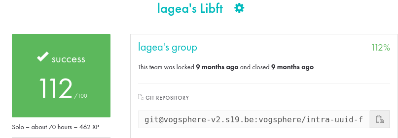

# libft

This repository contains my implementation of the [libft](docs/en.subject.pdf) project from [42](https://www.42.fr/). The goal of this project is to reimplement various standard C library functions, as well as additional utility functions that are commonly used in C development.



I've done all the bonuses, but i got 112/125 because I forgot the .macos file needed by the moulinette in our campus.

Link to the subject: [Link to the subject PDF](docs/en.subject.pdf)

## Table of Contents

1. [About the Project](#about-the-project)  
2. [Project Structure](#project-structure)  
3. [Functions Implemented](#functions-implemented)  
   1. [Mandatory Functions](#mandatory-functions)  
   2. [Bonus Functions](#bonus-functions)  
4. [Getting Started](#getting-started)  
5. [Usage](#usage)  

---

## About the Project

**libft** is a foundational project at 42 that recreates several crucial functions from the C standard library, such as string manipulation, memory handling, and character checks. Additionally, the project includes extra utility functions that facilitate day-to-day programming tasks in C.

### Objectives

- Practice writing clean, maintainable C code  
- Gain proficiency with library header files and Makefiles  
- Learn to structure and modularize code for reusability  
- Build a customized library that can be reused in future 42 projects

---

## Project Structure

- **sources files**  
  All sources files should be at the root of the directory as the subject indicates.

- **Makefile**  
  Defines compilation targets such as `all`, `clean`, `fclean`, and `re`.

---

## Functions Implemented

### Mandatory Functions

1. **String Functions**  
   - [`ft_strlen`](ft_strlen.c)
   - [`ft_strdup`](ft_strdup.c)
   - [`ft_strlcpy`](ft_strlcpy.c)
   - [`ft_strlcat`](ft_strlcat.c)
   - [`ft_strncmp`](ft_strncmp.c)
   - [`ft_strchr`](ft_strchr.c)
   - [`ft_strrchr`](ft_strrchr.c)
   - [`ft_strnstr`](ft_strnstr.c)
   - [`ft_atoi`](ft_atoi.c)

2. **Memory Functions**  
   - [`ft_calloc`](ft_calloc.c)
   - [`ft_memset`](ft_memset.c)
   - [`ft_bzero`](ft_bzero.c)
   - [`ft_memcpy`](ft_memcpy.c)
   - [`ft_memmove`](ft_memmove.c)
   - [`ft_memcmp`](ft_memcmp.c)
   - [`ft_memchr`](ft_memchr.c)

3. **Character Checks**  
   - [`ft_isalpha`](ft_isalpha.c)
   - [`ft_isdigit`](ft_isdigit.c)
   - [`ft_isalnum`](ft_isalnum.c)
   - [`ft_isascii`](ft_isascii.c)
   - [`ft_isprint`](ft_isprint.c)
   - [`ft_toupper`](ft_toupper.c)
   - [`ft_tolower`](ft_tolower.c)

4. **Additional Utility Functions**  
   - [`ft_itoa`](ft_itoa.c)
   - [`ft_substr`](ft_substr.c)
   - [`ft_strjoin`](ft_strjoin.c)
   - [`ft_strtrim`](ft_strtrim.c)
   - [`ft_split`](ft_split.c)
   - [`ft_strmapi`](ft_strmapi.c)
   - [`ft_striteri`](ft_striteri.c)
   - [`ft_putchar_fd`](ft_putchar_fd.c)
   - [`ft_putstr_fd`](ft_putstr_fd.c)
   - [`ft_putendl_fd`](ft_putendl_fd.c)
   - [`ft_putnbr_fd`](ft_putnbr_fd.c)

### Bonus Functions

The bonus part of **libft** typically involves handling singly linked lists, including creation, insertion, deletion, and iteration. The functions are:

   - [`ft_lstnew`](ft_lstnew_bonus.c)
   - [`ft_lstadd_front`](ft_lstadd_front_bonus.c)
   - [`ft_lstsize`](ft_lstsize_bonus.c)
   - [`ft_lstlast`](ft_lstlast_bonus.c)
   - [`ft_lstadd_back`](ft_lstadd_back_bonus.c)
   - [`ft_lstdelone`](ft_lstdelone_bonus.c)
   - [`ft_lstclear`](ft_lstclear_bonus.c)
   - [`ft_lstiter`](ft_lstiter_bonus.c)
   - [`ft_lstmap`](ft_lstmap_bonus.c)
---

## Getting Started

### Prerequisites

- A C compiler (e.g., Clang or GCC)
- The `make` utility

### Installation

1. **Clone the repository:**
   ```bash
   git clone https://github.com/leoagea/19_libft.git
   ```

2. **Go into the directory:**
   ```bash
   cd libft
   ```
   
3. **Compile the library**
   ```bash
   make
   ```

### Usage

1. **Include the library head**
   ```bash
   #include "libft.h"
   ```

2. **Link the library**
   ```bash
   gcc -Wall -Wextra -Werror -I includes/ main.c -L. -lft -o your_program
   ```